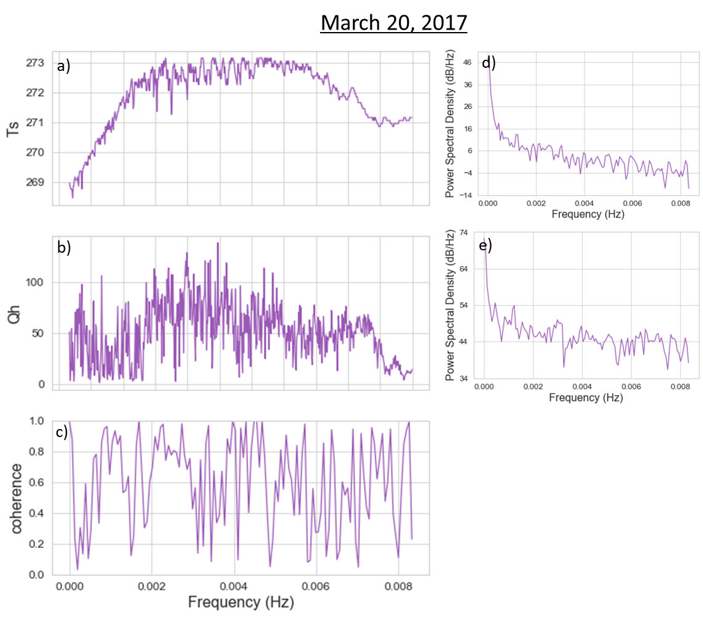

# atmos-boundary-layer
ATMS 547 project

# Simulating the sensible heat flux over a snow-surface in two different wind and temperature gradient conditions

### Steven Pestana | June 9, 2020 | ATM S 547

## Introduction:

Observations and computational models of seasonal snow in mountain environments are important for understanding local and regional-scale water resources and ecosystems, as well as the global climate system. As part of the local hydrologic cycle, humans depend on snowmelt from seasonal mountain snow for agriculture and growing food, generating electricity through hydropower, and providing drinking water for large urban centers (Barnett et al., 2005; Harpold &amp; Molotch, 2015). Seasonal snow also plays an important role in the global climate (Slater et al., 2001), with its high albedo reflecting incoming solar radiation, snow-cover provides a strong control over global surface energy budgets, and the loss of seasonal snow due to climate change can drive more dangerous climate feedbacks.

### Snow-Surface Energy Balance:

The snow-surface energy balance that drives snowmelt is largely controlled by net radiation (Male &amp; Granger, 1981) from the solar diurnal cycle, and periods of cloud cover. Snow has a very high albedo (Warren, 1982), and reflects much of the incoming shortwave radiation. However, snow albedo is sensitive to snow grain crystal sizes, and impurities on the snow surface such as dust or black carbon from pollution. Increasing the albedo will increase the energy input from shortwave radiation onto the snowpack, potentially leading to earlier snowmelt and shortened snow season duration. In the thermal infrared wavelengths, snow has a very high emissivity (Dozier &amp; Warren, 1982), largely insensitive to snow grain sizes, meaning that snow emits longwave radiation nearly as a perfect blackbody, following the Stefan-Boltzmann equation for radiance.

The turbulent energy fluxes of latent and sensible heat depend more on the local scale conditions, especially in windy mountain terrain where local wind fields are significantly modified by the surrounding topography (Mott et al., 2017). In in these complex mountain environments heterogeneous snow melt rates within mountain watersheds can have a large impact on streamflow timing (Lundquist &amp; Dettinger 2005). These turbulent fluxes also drive feedbacks with snow surface temperature, and therefore the upward longwave radiation emitted from the snow surface (Lapo et al., 2019).

While fluxes can be observed directly by various remote sensing methods, ranging from a few meters above the snow surface at instrumented monitoring sites, out to satellite imagery in the visible and infrared wavelengths, turbulent fluxes are difficult to measure even in situ, let alone remotely such as from a satellite sensor. In mountain environments where harsh winter weather conditions make direct measurements of turbulent fluxes (such as with sonic anemometers) or even simply wind speeds difficult or impossible as equipment breaks or freezes over.

Snow surface temperature as measured by fixed strings of thermocouples or infrared radiometers provides information that can be used for snow model evaluation or assimilation (Lapo et al., 2015). Measurements of snow-surface temperature may be able to reveal the turbulent energy flux patterns over time, or provide information about wind speed variability at short time scales since the snow surface responds quickly to changes in the net energy balance (Raleigh et al., 2013).

### Research Questions:

The main motivating research questions for this project is:

- Do fluctuations in the snow surface temperature represent the temporal patterns of turbulent fluxes or variations in wind speed?

It is hypothesized that snow-surface temperature as measured by IR radiometers can be used to derive patterns of turbulent flux and/or wind fluctuations at study sites that do not have anemometer measurements. To answer this question, I wanted to compare the temporal patterns and frequency spectrum of snow-surface temperature observations against sonic anemometer measurements of wind speed and calculated turbulent fluxes at the study site. To first establish a better understanding of the turbulent fluxes at this site, I first investigated the following questions:

- How are turbulent fluxes at the snow surface controlled by different wind regimes and/or temperature gradients?
- How do various methods of computing sensible heat flux perform when used in these different wind regimes?

## Data:

The data used in this project came from the CRREL &amp; UCSB Energy Site (CUES) at an elevation of 2940 m on Mammoth Mountain in the eastern Sierra Nevada of California (37.643, -119.029) from a record spanning March-April 2017 (Bair et al., 2015; Bair et al., 2018). Measurements at this site are made from a raised platform, 6 m above the snow-free ground surface. This site includes measurements of snow surface temperature from an Apogee IR radiometer, mounted on a boom that extends off the platform pointing down at the adjacent snow surface, which was maintained at a height of 1 m above the snow surface. The radiometer measures the brightness temperature within 8-14 um, and has an accuracy of 0.2 K, meaning temperature variations smaller than this value are indistinguishable from noise. Any surface temperature fluctuations that may represent turbulent fluxes or wind speed would need to exceed this threshold. Air temperature and relative humidity were measured by a Campbell Scientific HMP45C mounted about 3 m above the platform. A Lufft WS600 UMB ultrasonic anemometer measured three-component wind speeds with an accuracy of ± 1 m/s and ± 3° also mounted about 3 m above the platform.

|  |
| --- |
| **Figure 1:** (a) The CUES study site platform above the snow surface from which measurements from March 2017 (of air temperature, relative humidity, wind speed and direction, and snow surface temperature) were used. (b) Location of CUES on Mammoth Mountain, California within the eastern Sierra Nevada. Figure reproduced from Bair et al. (2015)._ |

## Methods:

Two days from the measurement period were chosen to represent different wind and temperature gradient regimes. The turbpy python package created by Karl Lapo (2018) was then used to compute the turbulent fluxes at the CUES site using and ensemble of methods with snow-surface temperature, air temperature, and wind speed as input data. This python package was developed for testing different turbulence modeling schemes of land surface models &quot;offline&quot; (the different schemes can be ran separate from the land surface models they&#39;re used within), to allow for method comparison, sensitivity tests, or ensemble calculations of turbulent fluxes.

In this project turbpy is used to estimate the turbulent fluxes (sensible heat flux is presented in the analysis) at the CUES site using two classes of methods: bulk aerodynamic methods that use the bulk Richardson number to scale turbulent fluxes, and Monin-Obukhov similarity theory methods where the conductance parameter is used to scale turbulent fluxes.

#### Bulk aerodynamic methods:

The bulk Richardson number is a ratio of the consumption of turbulence to the generation of turbulence by wind shear.

|  | _(1)_ |
| --- | --- |

Where the buoyant consumption of turbulence is a function of: (gravitational acceleration), (virtual temperature), (virtual potential temperature gradient over distance ), and the shear production of turbulence is a function of: and , the change in horizontal winds in the x and y directions. A critical bulk Richardson number can be defined (typically Ric = 0.25) for idealized situations. The critical number describes the threshold above which there would be stable conditions where turbulence is consumed by buoyancy more than it&#39;s generated, and below which there would be unstable conditions with shear generated turbulence more than can be consumed by buoyancy.

Each bulk aerodynamic method within turbpy defines a scaling parameter, , that is a function of Ri (see the different formulations of in Table 1 within Lapo et al., 2019). This scaling parameter is used alongside the von Karman constant (), and surface roughness length (), to calculate the conductance parameter, (Eqn. 2).

|  | _(2)_ |
| --- | --- |

#### Monin-Obukhov scaling theory methods:

The conductance parameter used in the Monin-Obukhov scaling theory methods uses two stability correction parameters, and, for momentum and heat respectively. These stability correction parameters are a function of the Obukov Length (Eqn. 3), with (Lapo et al., 2019).

|  | _(3)_ |
| --- | --- |

The Obukhov length, L (Eqn. 4), is defined via dimensional analysis (Garratt, 1992). This length scale describes the relative contributions to turbulent flow from momentum and buoyancy. Momentum flux is represented by friction velocity, , the surface stress at the land-atmosphere interface (Eqn. 5). Buoyancy is represented by a buoyancy flux term, (Eqn. 6), and the von Karman constant, .

|  | _(4)_ |
| --- | --- |

|  | _(5)_ |
| --- | --- |

|  | _(6)_ |
| --- | --- |

Nine different turbulence schemes are used within turbpy to estimate the turbulent fluxes at the CUES site for March 1st and March 20th. For each day, the ensemble of turbulent fluxes are compared to identify how these different methods respond to the same forcing data. Differences between the methods are explored, and outlier methods are removed to compute an ensemble mean. The ensemble mean is used two compare the two wind and temperature gradient regimes.

## Results and Discussion:

Chosen to represent a weaker wind regime, March 1st had a large temperature gradient of about 20 °C at night, decreasing to about 10 °C during the day (Fig. 3b). Air temperatures ranged between -5 °C at night to 5 °C in the afternoon, while snow temperatures ranged between -25 °C and -8 °C (Fig. 2a). Wind speeds on March 1st were low, within 1 ms-1 to 4 ms-1, reaching a maximum in the afternoon (Fig. 2b).

March 20th represents a stronger wind regime and had a small temperature gradient between snow and air (Fig. 3f), 6 °C at night, decreasing to \&lt; 5 °C during the day, and later on \&lt; 1 °C in the evening as winds picked up. Air temperatures had a range -2 °C to 5 °C, similar to March 1st, but snow temperatures were much warmer, between -5 °C and 0 °C (Fig. 2d). Winds were stronger on the 20th, from 2 ms-1 to 11 m s-1, reaching maximum speeds around 6 PM (Fig. 2e).

|  |
| --- |
| **Figure 2:** For the two days of observations used in this project, timeseries plots of (a,d) air and surface temperatures, (b,e) wind speeds, and (c,f) bulk Richardson numbers._ |

### Bulk Richardson Number:

Under the weak wind conditions on March 1st, the bulk Richardson number is much greater than the critical Richardson number over most of the day (Fig. 2c). It is highest in the nighttime hours where consistently, Ri \&gt; 1, and for small bursts Ri \&gt;\&gt; 5. This indicates strongly stable conditions at night when the temperature gradient between the snow surface and air temperature at 6 m is the greatest (~20 °C). During the daytime hours the bulk Richardson number decreases and approaches a minimum of 0.1, just below the critical value. This indicates that as the snow surface heats up largely due to radiative forcing, the temperature gradient decreases and the boundary layer becomes less stable and approaches a weakly turbulent state for short periods of time.

With stronger wind conditions and warmer snow surface temperatures on March 20th, throughout the day Ri \&lt; 1, except for a few short periods (Fig. 2f). In the night and early morning Ri fluctuates above and below the critical value, indicating that the boundary later is switching between short periods of weak stability and periods of turbulence. This nighttime period corresponds with the lower wind speeds averaging about 5 ms-1. In the daytime, Ri \&lt;\&lt; 0.1, which indicates turbulent conditions and corresponds with wind speeds up to 11 ms-1.

|  |
| --- |
| **Figure 3:** For the two days of observations used in this project, timeseries plots of (a,e) air and surface temperatures, (b,f) temperature gradients, and sensible heat flux estimated with (c,g) bulk aerodynamic methods and with (d,h) Monin-Obukhov methods. |

### Sensible Heat Flux:

In the weaker wind speed regime on March 1st, the sensible heat fluxes for most methods agree where Qh \&lt; 50 Wm-2 throughout the day (Fig. 3c,d). Only the two &quot;capped&quot; methods show sensible heat flux exceeding 50 Wm-2, reaching nearly as high as 200 Wm-2. To investigate why these capped methods deviate from the others, the sensible heat flux is plotted against both wind speed (Fig. 4a) and the temperature gradient (Fig. 4b) for this day. This shows that at the lowest wind speeds (\&lt; 1 ms-1), the capped methods estimate positive sensible heat fluxes, whereas the other methods do not estimate any sensible heat flux until winds reach 2-4 ms-1. Ignoring the outlier &quot;capped&quot; methods, bulk methods estimate Qh within 0-75 Wm-2 over the course of the day, while the MOST methods estimate Qh within 0-50 Wm-2.

In the stronger wind conditions on March 20th, the sensible heat flux across all methods agree closely (Fig. 3g,h). The most variation between the different methods occurs in the nighttime, where sensible heat flux varies the most (0-80 Wm-2). All methods agree more closely during the daytime, and between about 5 PM and 8 PM all methods converge within \&lt; 1 Wm-2 of each other. This period of convergence coincides with the snow-air temperature gradient dropping to \&lt; 1 °C (Fig. 3f) as wind speeds reached their maximum values of ~11 ms-1(Fig. 2e), and Ri = 0 (Fig. 2f), suggesting that these methods agree most closely under very well-mixed conditions. Setting aside the capped methods, the bulk methods show Qh within 0-180 Wm-2, and the MOST methods show Qh within 0-120 Wm‑2.

On March 20th, we can see that at the higher wind speeds throughout the day, all methods show sensible heat flux scaling linearly with wind speed (Fig. 4c). Only with wind speeds \&lt; 3 ms-1 is there significant divergence among the methods, where the capped methods overestimate sensible heat fluxes. At very small temperature gradients, there is stronger correlation between the temperature gradient and sensible heat flux than when the gradient is larger (Fig. 4d).

The turbpy documentation and source code (Lapo, 2018) provides additional information about why the capped methods might be deviating from the other methods, especially in the weaker wind regime on March 1st. These methods include a threshold Richardson number, that &quot;caps&quot; the maximum value Rist is allowed to reach. For the bulk aerodynamic Louis (1979) method, Rist = 0.026; and for the Monin-Obukhov Holtslag and de Bruin method (Holtslag &amp; De Bruin, 1988), Rist = 1.43. Therefore, on March 1st where Ri is typically much larger than these threshold values, these two methods force Ri to a lower value, producing erroneously high Qh values as if there conditions were much more turbulent than observed. The capped methods were removed before computing an ensemble mean sensible heat flux for each day.

|  |
| --- |
| **Figure 4:** Visualizing the sensitivity of estimated sensible heat flux to (a,c) wind speeds, and (b,d) temperature gradients. |

## Conclusions and Future Work:

The two days investigated help demonstrate the effects that wind and the resulting temperature gradients have on turbulent fluxes over snow-covered land surface. Warmer (melting) snow-surface temperature and higher winds showed unstable conditions with high sensible heat fluxes, while colder snow-surface temperature and lower winds exhibited stable conditions with very low to zero sensible heat flux. This likely represents a decoupling of the surface and atmosphere with a strong boundary layer inversion at the atmosphere-surface interface. Winds were the primary control on sensible heat flux under the windier conditions except where the temperature gradient was smallest. Winds were still the primary control on sensible heat flux even in the weaker wind conditions with large temperature gradient.

The two methods that introduced a &quot;capped&quot; Richardson number methods do not seem applicable to low-wind conditions where high Ri values are expected, and perhaps are most useful only for modeling turbulent fluxes under weakly stable or turbulent conditions. The bulk aerodynamic methods that scaled turbulent fluxes using Ri estimated consistently larger turbulent fluxes than the Monin-Obukhov methods which scaled turbulent fluxes with the Obukhov length.

Future work can address the original motivating question, now with ensemble-mean records of sensible heat flux at the CUES site for these two days. Figure 5 shows a preliminary coherence plot (Fig. 5c) between snow-surface temperature and the ensemble-mean sensible heat flux as well as and frequency spectra for each (Fig. 5 d,e).

|  |
| --- |
|  **Figure 5** : Time series of (a) snow-surface temperature, (b) ensemble-mean sensible heat flux, and their resulting (c) coherence. Frequency spectra of (d) snow-surface temperature and (e) sensible heat flux variations. |

## References:

Bair, E. H., Davis, R. E., &amp; Dozier, J. (2018). Hourly mass and snow energy balance measurements from Mammoth Mountain, CA USA, 2011-2017. _Earth System Science Data_, _10_(1), 549–563. doi:10.5194/essd-10-549-2018

Bair, E. H., Dozier, J., Davis, R. E., Colee, M. T., &amp; Claffey, K. J. (2015). CUES—a study site for measuring snowpack energy balance in the sierra Nevada. _Frontiers in Earth Science_, _3_(September). doi:10.3389/feart.2015.00058

Barnett, T. P., Adam, J. C., &amp; Lettenmaier, D. P. (2005). Potential impacts of a warming climate on water availability in snow-dominated regions. _Nature_, _438_(7066), 303–309. https://doi.org/10.1038/nature04141

Dozier, J., &amp; Warren, S. G. (1982). Effect of viewing angle on the infrared brightness temperature of snow. _Water Resources Research_, _18_(5), 1424–1434. https://doi.org/10.1029/WR018i005p01424

Garratt, J. R. (1992). The Atmospheric Boundary Layer. _Cambridge University Press_. Cambridge 316.

Harpold, A. A., &amp; Molotch, N. P. (2015). Sensitivity of soil water availability to changing snowmelt timing in the western US. Geophysical Research Letters, 42(19), 8011-8020.

Holtslag, A. A. M., &amp; De Bruin, H. A. R. (1988). Applied modeling of the nighttime surface energy balance over land. _Journal of Applied Meteorology_, 27(6), 689–704. doi: 10.1175/1520-0450(1988)027\&lt;0689:AMOTNS\&gt;2.0.CO;2

Lapo, K., Nijssen, B., &amp; Lundquist, J. D. (2019). Evaluation of turbulence stability schemes of land models for stable conditions. _Journal of Geophysical Research: Atmospheres_, _124_(6), 3072-3089. doi: 10.1029/2018JD028970

Lapo, K. E. (2018). Turbpy Python package for simulating turbulence. Seattle, WA: University of Washington. doi:10.5281/zenodo.1421061

Lapo, K. E., Hinkelman, L. M., Raleigh, M. S., &amp; Lundquist, J. D. (2015). Impact of errors in the downwelling irradiances on simulations of snow water equivalent, snow surface temperature, and the snow energy balance. _Water Resources Research_, _51_(3), 1649–1670. https://doi.org/10.1002/2014WR016259

Louis, J. F. (1979). A parametric model of vertical eddy fluxes in the atmosphere. _Boundary-Layer Meteorology_, _17_(2), 187-202. doi:10.1007/BF00117978

Lundquist, J. D., &amp; Dettinger, M. D. (2005). How snowpack heterogeneity affects diurnal streamflow timing. _Water Resources Research_, _41_(5), 1–14. https://doi.org/10.1029/2004WR003649

Male, D. H., &amp; Granger, R. J. (1981). Snow surface energy exchange. _Water Resources Research_, _17_(3), 609–627. https://doi.org/10.1029/WR017i003p00609

Mott, R., Schlögl, S., Dirks, L., &amp; Lehning, M. (2017). Impact of extreme land surface heterogeneity on Micrometeorology over spring snow cover. _Journal of Hydrometeorology_, _18_(10), 2705–2722. https://doi.org/10.1175/JHM-D-17-0074.1

Raleigh, M. S., Landry, C. C., Hayashi, M., Quinton, W. L., &amp; Lundquist, J. D. (2013). Approximating snow surface temperature from standard temperature and humidity data: New possibilities for snow model and remote sensing evaluation. _Water Resources Research_, _49_(12), 8053–8069. https://doi.org/10.1002/2013WR013958

Slater, A. G., Schlosser, C. A., Desborough, C. E., Pitman, A. J., Henderson-Sellers, A., Robock, A., … Zeng, Q. (2001). The Representation of Snow in Land Surface Schemes: Results from PILPS 2(d). _Journal of Hydrometeorology_, _2_(1), 7–25. Retrieved from www.jstor.org/stable/24909324

Warren, S. G. (1982). Optical properties of snow. _Reviews of Geophysics_, _20_(1), 67–89. https://doi.org/10.1029/RG020i001p00067